# DessertHub
## This project was developed as a team project with 3 members. 
----

   
  <b>作品紹介</b>

   
  <b>サーバー構造の概要</b>

   
  <b>データベース ERD</b>

  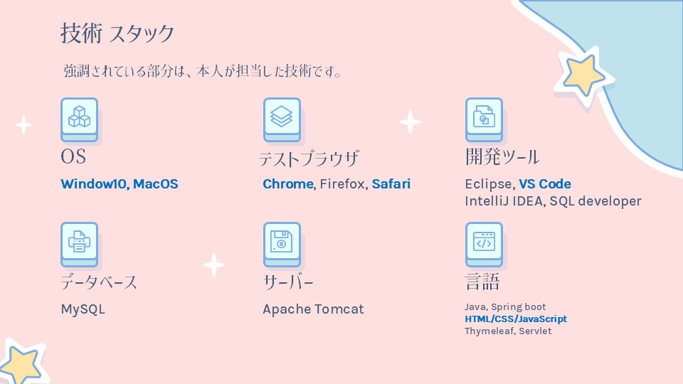 
  <b>技術 スタック</b>

  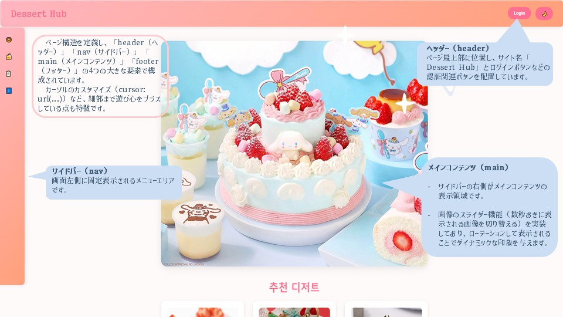 
  <b>Main</b>

  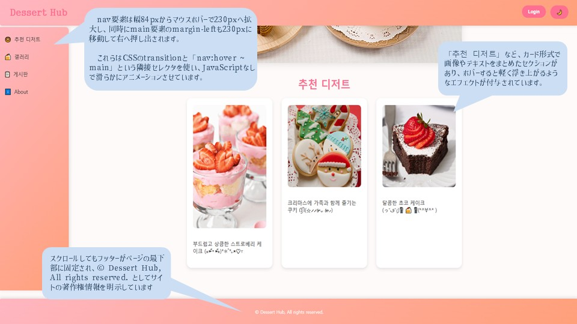 
  <b>Main footer</b>

  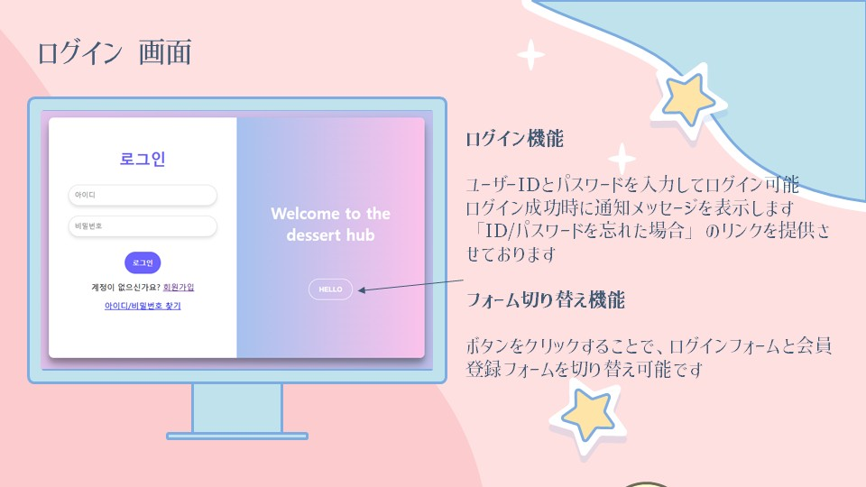 
  <b>ログイン 画面</b>

   
  <b>会員登録 画面</b>

  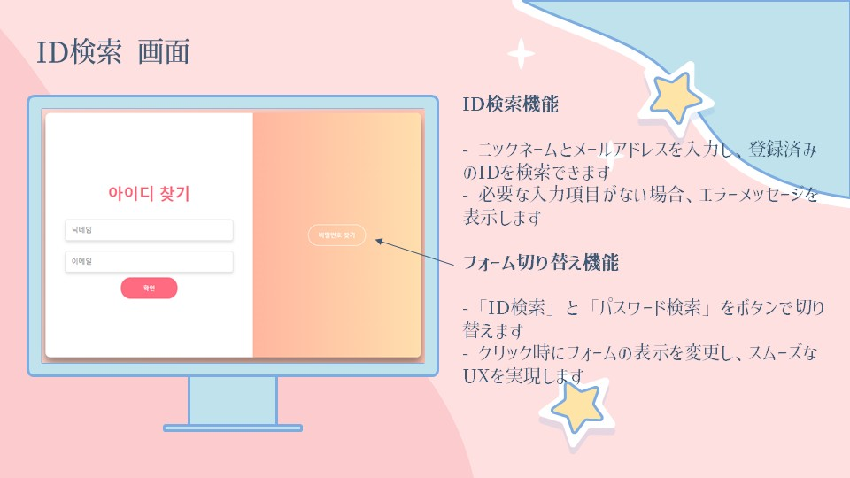 
  <b>ID検索 画面</b>

  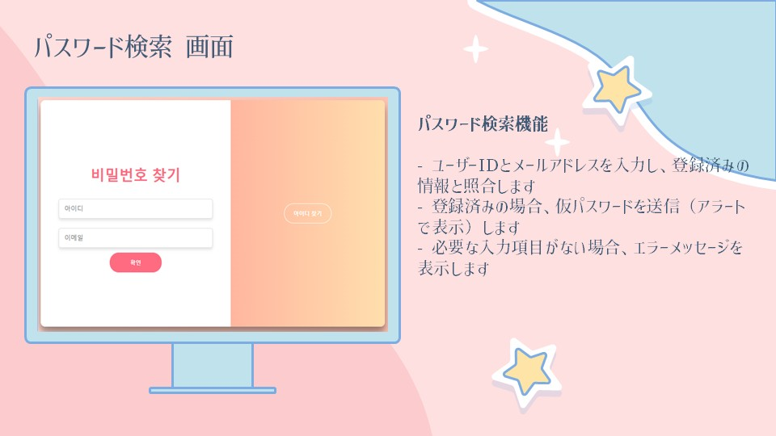 
  <b>パスワード検索 画面</b>

   
  <b>マイページ 画面</b>

  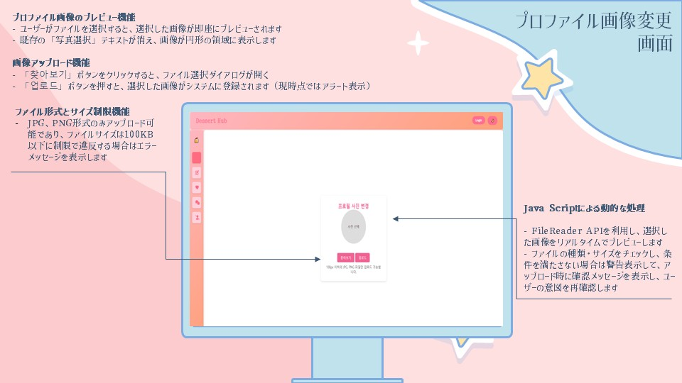 
  <b>プロファイル画像 変更画面</b>

   
  <b>ユーザー情報編集 画面</b>

  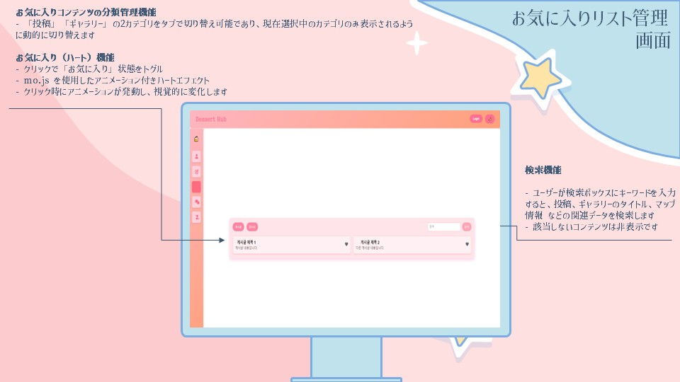 
  <b>お気に入りリスト管理 画面</b>

  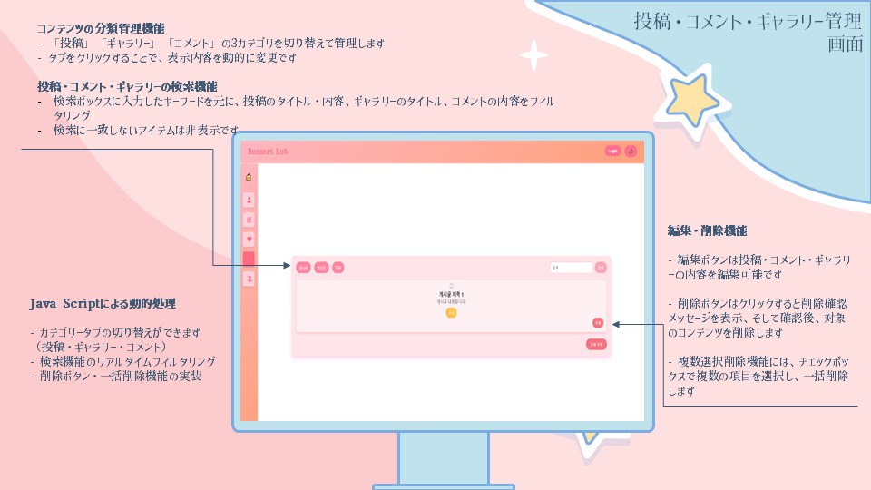 
  <b>投稿・コメント・ギャラリー管理画面</b>

   
  <b>会員退会管理 画面</b>

   
  <b>掲示板 画面</b>

   
  <b>掲示板投稿 画面</b>

   
  <b>投稿の詳細 画面</b>

  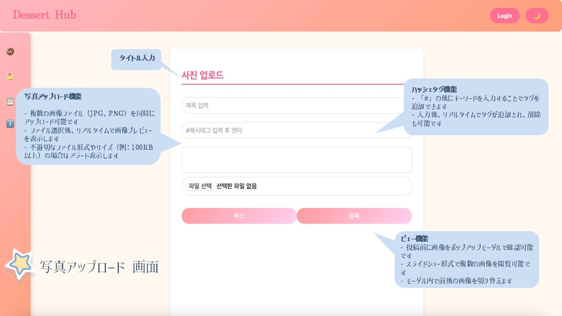 
  <b>写真アップロード 画面</b>

   
  <b>サイト紹介 画面</b>

  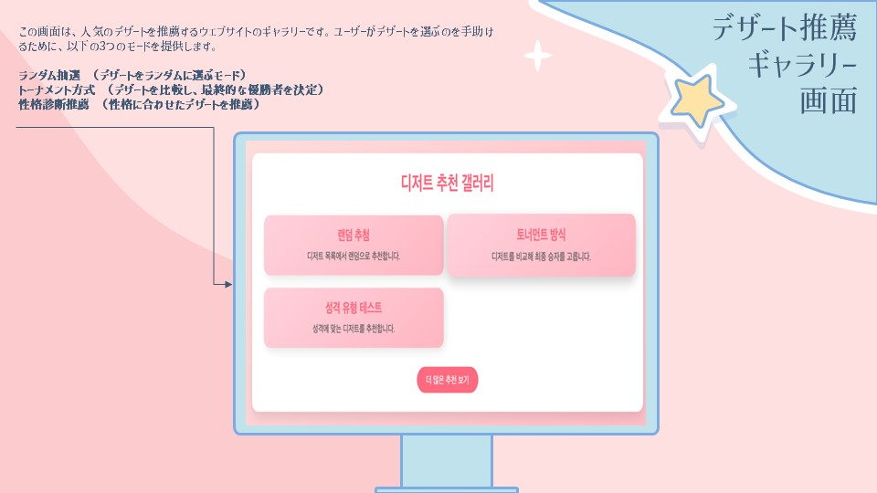 
  <b>デザート推薦ギャラリー 画面</b>

  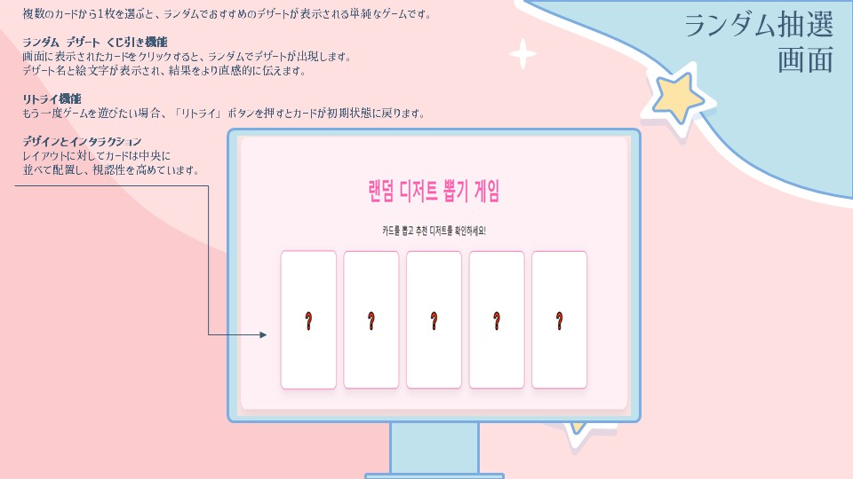 
  <b>ランダム抽選 画面</b>

   
  <b>性格診断ゲーム 画面</b>

   
  <b>トーナメント方式 　画面</b>

  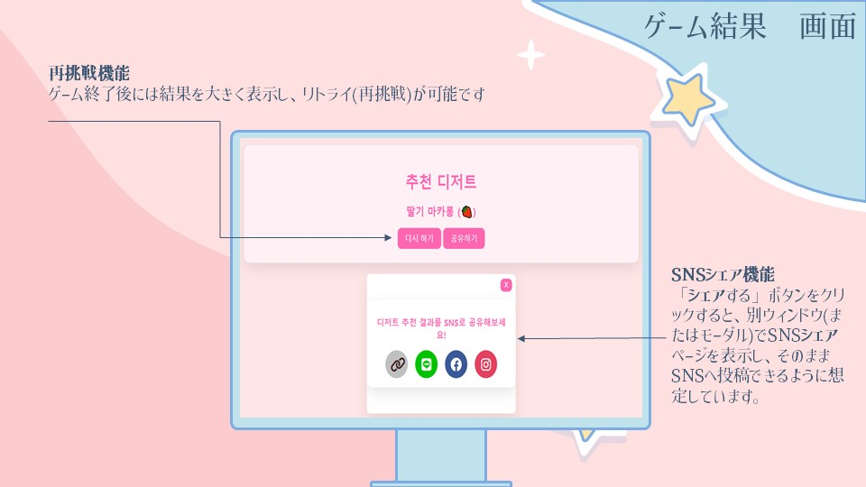 
  <b>ゲーム結果　画面</b>

  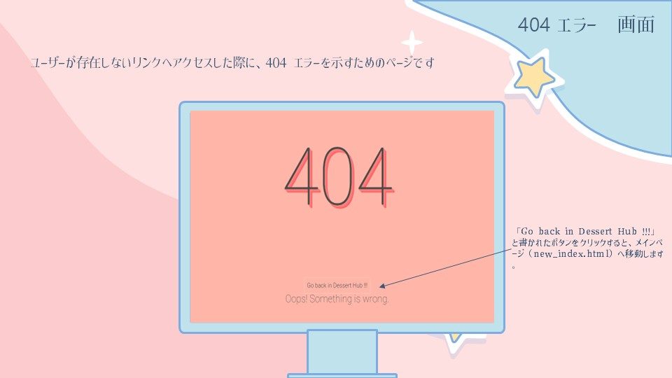 
  <b>404 エラー  画面</b>

   
  <b>所感</b>

